# Tài liệu Kỹ thuật Chi tiết: Các Luồng Xử lý trong Hệ thống DeviceEventHistory

---

## Mục lục

1. [Tổng quan Kiến trúc & Nguyên lý Thiết kế](#1-tổng-quan-kiến-trúc--nguyên-lý-thiết-kế) (Trang 1)
2. [Flow 1: Startup & Khởi tạo Index MongoDB](#flow-1-startup--khởi-tạo-index-mongodb) (Trang 2)
3. [Flow 2: Source Discovery & Quản lý File Registry](#flow-2-source-discovery--quản-lý-file-registry) (Trang 3)
4. [Flow 3: Fair File Scheduling & Điều phối Đa Luồng Consumer](#flow-3-fair-file-scheduling--điều-phối-đa-luồng-consumer) (Trang 4)
5. [Flow 4: Chunk Tail Reading & Đóng khung Bản ghi (Record Framing)](#flow-4-chunk-tail-reading--đóng-khung-bản-ghi-record-framing) (Trang 5)
6. [Flow 5: Tokenization, Phân tích Cú pháp & Canonical Mapping](#flow-5-tokenization-phân-tích-cú-pháp--canonical-mapping) (Trang 6)
7. [Flow 6: Idempotent Persistence & OCC Checkpoint Advance](#flow-6-idempotent-persistence--occ-checkpoint-advance) (Trang 7)
8. [Flow 7: Health Monitoring, Metrics Telemetry & Graceful Shutdown](#flow-7-health-monitoring-metrics-telemetry--graceful-shutdown) (Trang 8)
9. [Ma trận Tương tác giữa các Flow & Bảng Ánh xạ Source Code](#9-ma-trận-tương-tác-giữa-các-flow--bảng-ánh-xạ-source-code) (Trang 9)

<div class="page-footer"><span>DeviceEventHistory — Technical Flows</span><span>Trang 1</span></div>
<div class="page-break"></div>

---

## 1. Tổng quan Kiến trúc & Nguyên lý Thiết kế

### Vấn đề bài toán
Hệ thống **DeviceEventHistory** nhận nhiệm vụ thu nạp dòng log thô (raw log) từ các thiết bị đọc RFID đặt tại các nhà máy/cổng trạm theo thời gian thực. Các file log được ghi liên tục dạng append-only, có thể phân tán trên hệ thống file cục bộ (`Local`) hoặc qua giao thức HTTP (`RemoteHttp`).

Để đảm bảo hiệu năng cao, độ tin cậy tuyệt đối và tính toàn vẹn dữ liệu, kiến trúc giải quyết 4 bài toán kỹ thuật trọng tâm:
1. **Lập lịch công bằng (Fair Scheduling)**: Tránh tình trạng đói tài nguyên (starvation) khi có file dung lượng lớn hoặc tốc độ ghi cao áp đảo các file khác.
2. **Nguyên tử & Chống trùng lặp (Idempotency & OCC Checkpointing)**: Đảm bảo khả năng xử lý Exactly-Once trên tầng lưu trữ bằng cách kết hợp SHA256 Deterministic Identity và Optimistic Concurrency Control (OCC) trên Checkpoint.
3. **Đóng khung biên byte (Boundary Framing)**: Tự động ghép nối các khối byte stream rời rạc qua mạng/đĩa thành các bản ghi hoàn chỉnh kết thúc bằng ký tự `!` (`AppConst.RawLog.RecordTerminator`).
4. **Cô lập lỗi bản ghi (Dead-letter Isolation)**: Các bản ghi lỗi cú pháp không làm crash worker mà được lưu riêng vào `device_event_failures` và tiếp tục đẩy vị trí đọc (checkpoint).

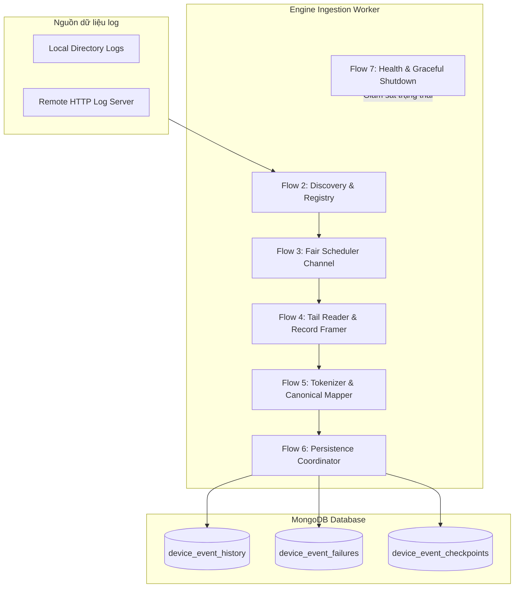

<div class="page-footer"><span>DeviceEventHistory — Technical Flows</span><span>Trang 1</span></div>
<div class="page-break"></div>

---

## Flow 1: Startup & Khởi tạo Index MongoDB

### Vấn đề là gì?
Trước khi worker tiếp nhận dữ liệu và thực hiện các thao tác insert/upsert đồng thời cao, toàn bộ các bảng/collections trong MongoDB phải được tạo sẵn các chỉ mục ràng buộc (Unique Indexes) và chỉ mục tra cứu (TTL, Compound Index). Đồng thời cấu hình nhạy cảm cần được che giấu (redacted) trong log khởi động.

### CallGraph (Mermaid)
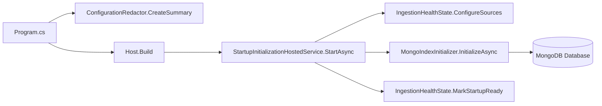

### Flowchart Logic
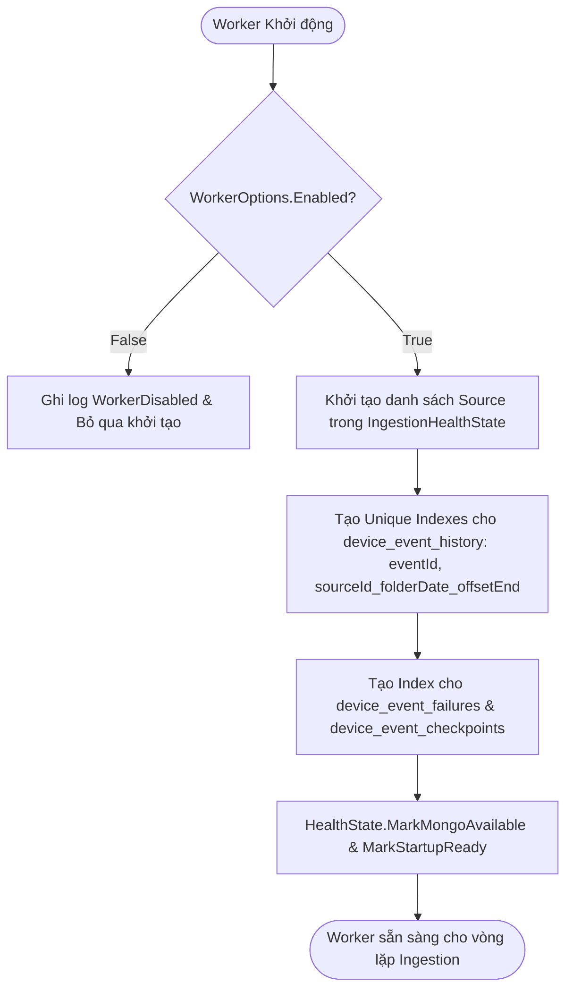

### Code snippet thực tế
```csharp
// src/DeviceEventHistory.Worker/HostedServices/StartupInitializationHostedService.cs:19-35
public async Task StartAsync(CancellationToken cancellationToken)
{
    if (!workerOptions.Value.Enabled)
    {
        return;
    }

    healthState.ConfigureSources(
        rawLogOptions.Value.Sources
            .Where(source => source.Enabled)
            .Select(source => source.SourceId));
    await indexInitializer.InitializeAsync(cancellationToken);
    healthState.MarkMongoAvailable();
    healthState.MarkStartupReady();
    logger.LogInformation(AppConst.Logging.MongoIndexesInitializedMessage);
}
```

### Bảng Mapping & Nhiệm vụ
| Thành phần | Đầu vào | Xử lý | Kết quả |
| :--- | :--- | :--- | :--- |
| **Config Redactor** | `IConfiguration` | Ẩn mật khẩu trong MongoDB URI | Log tóm tắt cấu hình an toàn |
| **Mongo Index Initializer** | `MongoDbContext` | Tạo index tự động qua MongoDB Driver | Đảm bảo Unique Index chống trùng lặp |
| **Health State** | `SourceId[]` | Cấu hình threshold lỗi ban đầu | `StartupReady = true`, `MongoAvailable = true` |

### Ẩn dụ thực tế (Analogy)
Giống như việc kiểm tra độ an toàn, lắp đặt hệ thống đường ray và tín hiệu đèn giao thông trước khi đưa đoàn tàu hàng vào vận hành chính thức.

<div class="page-footer"><span>DeviceEventHistory — Technical Flows</span><span>Trang 2</span></div>
<div class="page-break"></div>

---

## Flow 2: Source Discovery & Quản lý File Registry

### Vấn đề là gì?
Hệ thống cần liên tục phát hiện các file log mới được tạo ra hoặc file log cũ đang được ghi thêm dữ liệu trong khoảng thời gian cửa sổ lùi (`LookbackDays`), ánh xạ thành các mô tả file (`RawLogFileDescriptor`) và duy trì trạng thái theo dõi trong `FileRegistry`.

### CallGraph (Mermaid)
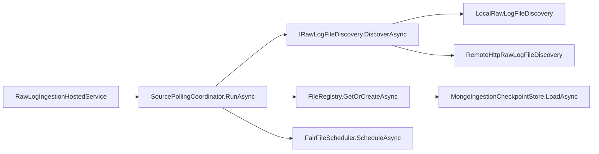

### Flowchart Logic
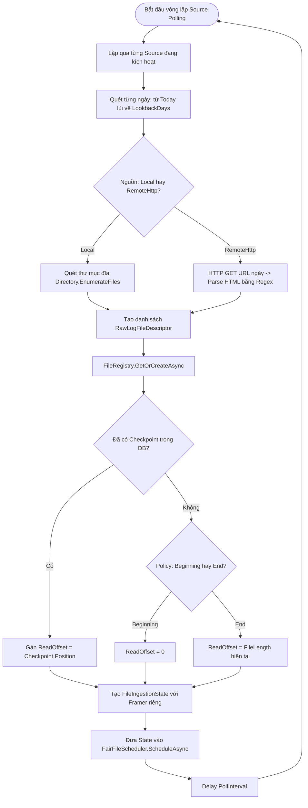

### Code snippet thực tế
```csharp
// src/DeviceEventHistory.Worker/Orchestration/SourcePollingCoordinator.cs:77-101
foreach (var descriptor in descriptors)
{
    try
    {
        var state = await fileRegistry.GetOrCreateAsync(
            descriptor,
            startupExistingFile,
            cancellationToken);
        await scheduler.ScheduleAsync(state, cancellationToken);
    }
    catch (OperationCanceledException) when (cancellationToken.IsCancellationRequested)
    {
        throw;
    }
    catch (Exception exception)
    {
        logger.LogWarning(
            exception,
            AppConst.Logging.FileStateInitializationFailedMessage,
            descriptor.SourceId,
            descriptor.FileId,
            descriptor.FolderDate);
    }
}
```

```csharp
// src/DeviceEventHistory.Worker/Orchestration/FileRegistry.cs:47-66
var checkpoint = await checkpointStore.LoadAsync(key, cancellationToken);
var hasPersistedCheckpoint = checkpoint is not null;
var initialPosition = checkpoint?.Position ??
    await ResolveInitialPositionAsync(descriptor, startupExistingFile, cancellationToken);

checkpoint ??= new IngestionCheckpoint
{
    Key = key,
    Position = initialPosition,
    UpdatedAtUtc = timeProvider.GetUtcNow(),
    Version = 0
};

var state = new FileIngestionState(
    descriptor,
    checkpoint,
    initialPosition,
    framerFactory(),
    startupExistingFile);
```

### Bảng Ánh xạ Nguồn dữ liệu
| Chế độ Nguồn | Quy tắc đường dẫn / URL | Dữ liệu khởi tạo Descriptor |
| :--- | :--- | :--- |
| **`Local`** | `{RootPath}/{YYYY}/{MM}/{DD}/*.log` | `Mode: Local`, `Location: /path/file.log`, `FileLength: FileInfo.Length` |
| **`RemoteHttp`** | `{BaseUrl}/{YYYY}/{MM}/{DD}/` | `Mode: RemoteHttp`, `Location: http://.../file.log`, `FileLength: null` |

### Ẩn dụ thực tế (Analogy)
Nhân viên bưu điện đi kiểm tra tất cả các hộp thư tại các trạm; ghi nhận vị trí thư mới xuất hiện và kẹp thẻ đánh dấu tiến độ đọc cho từng hộp.

<div class="page-footer"><span>DeviceEventHistory — Technical Flows</span><span>Trang 3</span></div>
<div class="page-break"></div>

---

## Flow 3: Fair File Scheduling & Điều phối Đa Luồng Consumer

### Vấn đề là gì?
Nếu một file có dung lượng hàng GB được xử lý một mạch từ đầu đến cuối, các file khác sẽ bị trễ nghiêm trọng. Để giải quyết, hệ thống thiết kế cơ chế **Lập lịch xoay vòng theo Budget (Turn-based)** qua `System.Threading.Channels.Channel<FileIngestionState>`. Mỗi file chỉ được xử lý trong phạm vi hạn mức: `MaxBytesPerTurn`, `MaxRecordsPerTurn`, hoặc `MaxTurnDuration`.

### CallGraph (Mermaid)
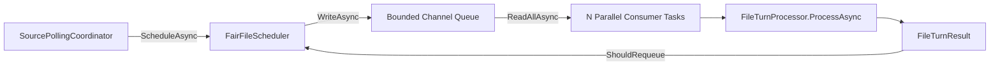

### Flowchart Logic
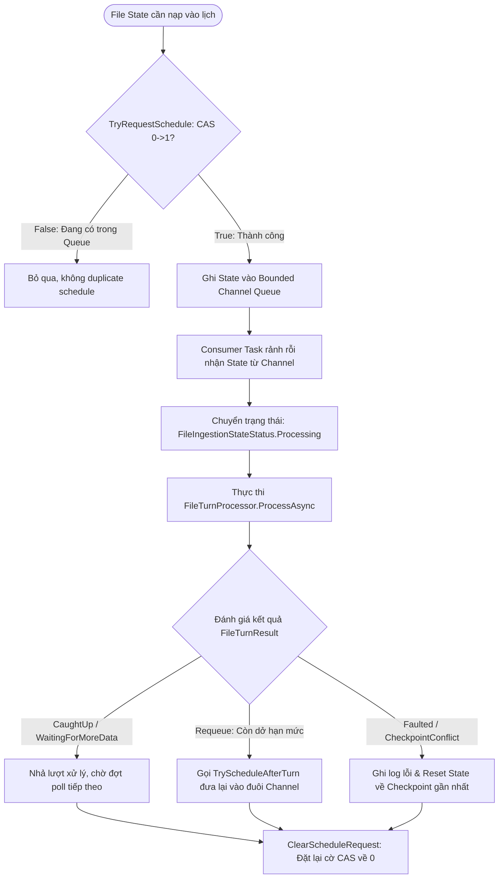

### Code snippet thực tế
```csharp
// src/DeviceEventHistory.Worker/Orchestration/FairFileScheduler.cs:68-109
private async Task ConsumeAsync(CancellationToken cancellationToken)
{
    await foreach (var state in queue.Reader.ReadAllAsync(cancellationToken))
    {
        if (state.IsStopped)
        {
            state.ClearScheduleRequest();
            continue;
        }

        state.SetStatus(FileIngestionStateStatus.Processing);
        telemetry.RecordFileProcessingStarted(state.Descriptor.SourceId, state.Descriptor.FileId);
        using var fileScope = LoggingScopes.BeginFileScope(
            logger,
            workerId,
            state.Descriptor,
            state.Checkpoint.Position,
            state.ReadOffset);
        FileTurnResult result;
        try
        {
            result = await processor.ProcessAsync(state, cancellationToken);
        }
        catch (OperationCanceledException) when (cancellationToken.IsCancellationRequested)
        {
            state.ResetToCheckpoint();
            state.SetStatus(FileIngestionStateStatus.Ready);
            state.ClearScheduleRequest();
            throw;
        }
        // ... Xử lý cập nhật trạng thái và requeue
```

```csharp
// src/DeviceEventHistory.Worker/Orchestration/FileIngestionState.cs:93-107
public bool TryRequestSchedule()
{
    if (Interlocked.CompareExchange(ref scheduleRequested, 1, 0) == 0)
    {
        return true;
    }

    Interlocked.Exchange(ref wakeRequested, 1);
    return false;
}

public void ClearScheduleRequest() => Volatile.Write(ref scheduleRequested, 0);

public bool ConsumeWakeRequest() => Interlocked.Exchange(ref wakeRequested, 0) == 1;
```

### Ẩn dụ thực tế (Analogy)
Bác sĩ tại bệnh viện khám cho bệnh nhân theo lượt 5 phút. Nếu ca bệnh phức tạp chưa xong ngay, bệnh nhân được phát số mới để xếp hàng quay lại sau, giúp tất cả các bệnh nhân khác đều được phục vụ kịp thời.

<div class="page-footer"><span>DeviceEventHistory — Technical Flows</span><span>Trang 4</span></div>
<div class="page-break"></div>

---

## Flow 4: Chunk Tail Reading & Đóng khung Bản ghi (Record Framing)

### Vấn đề là gì?
Dữ liệu đọc theo từng khối byte (`ReadBufferBytes`) từ đĩa hoặc HTTP Range Request thường bị cắt ngang giữa chừng một bản ghi. `RawLogRecordFramer` có nhiệm vụ duy trì buffer byte dở dang (`pending`), liên tục phát hiện ký tự kết thúc bản ghi `!` (`AppConst.RawLog.RecordTerminator`), cắt bỏ CRLF thừa và đóng gói thành `FramedRawLogRecord` với `StartOffset` và `EndOffsetExclusive` chính xác.

### CallGraph (Mermaid)
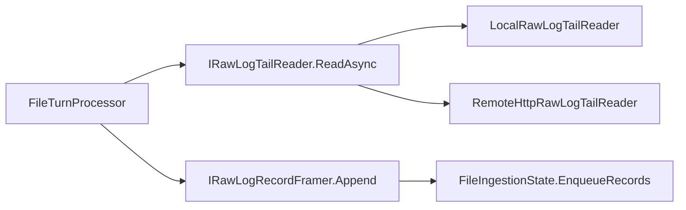

### Flowchart Logic
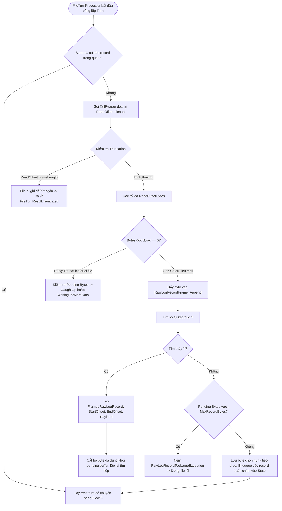

### Code snippet thực tế
```csharp
// src/DeviceEventHistory.Infrastructure/RfidRawLog/Framing/RawLogRecordFramer.cs:22-60
public IReadOnlyList<FramedRawLogRecord> Append(ReadOnlyMemory<byte> data, long startOffset)
{
    if (data.Length == 0)
    {
        return [];
    }

    if (!hasPendingStartOffset)
    {
        pendingStartOffset = startOffset;
        hasPendingStartOffset = true;
    }
    else if (pendingStartOffset + pending.Count != startOffset)
    {
        throw new ArgumentException(
            AppConst.Messages.MSG_RAW_LOG_CHUNK_NOT_CONTIGUOUS,
            nameof(startOffset));
    }

    pending.AddRange(data.ToArray());
    TrimLeadingLineBreaks();

    var records = new List<FramedRawLogRecord>();
    while (true)
    {
        var terminatorIndex = FindTerminator();
        if (terminatorIndex < 0)
        {
            break;
        }

        var recordLength = terminatorIndex + RecordTerminator.Length;
        if (recordLength < pending.Count && pending[recordLength] == (byte)'\r')
        {
            recordLength++;
            if (recordLength < pending.Count && pending[recordLength] == (byte)'\n')
            {
                recordLength++;
            }
        }
        else if (recordLength < pending.Count && pending[recordLength] == (byte)'\n')
        {
            recordLength++;
        }

        records.Add(new FramedRawLogRecord
        {
            StartOffset = pendingStartOffset,
            EndOffsetExclusive = pendingStartOffset + recordLength,
            Payload = pending.Take(recordLength).ToArray()
        });

        pending.RemoveRange(0, recordLength);
        pendingStartOffset += recordLength;
        TrimLeadingLineBreaks();
    }
    // ...
```

### Bảng Minh họa Xử lý Byte Stream
| Byte Stream Chunk Đến | Trạng thái Buffer trước | Ký tự kết thúc `!` | Kết quả Bản ghi đóng gói | Buffer dở dang còn lại |
| :--- | :--- | :--- | :--- | :--- |
| `H(E280,09:00:00,1,2)` | *(Trống)* | Không thấy | *(0 bản ghi)* | `H(E280,09:00:00,1,2)` |
| `S(1,2026/08/27)!H(E28`| `H(E280,...)` | Tìm thấy tại cuối `!` | 1 bản ghi: `H(...)S(...)!` | `H(E28` |

### Ẩn dụ thực tế (Analogy)
Băng chuyền đóng gói bánh kẹo: máy dập liên tục quét bao bì, khi nhìn thấy vạch phân cách màu đỏ (`!`) thì thực hiện cắt và dán kín mép từng gói kẹo hoàn chỉnh.

<div class="page-footer"><span>DeviceEventHistory — Technical Flows</span><span>Trang 5</span></div>
<div class="page-break"></div>

---

## Flow 5: Tokenization, Phân tích Cú pháp & Canonical Mapping

### Vấn đề là gì?
Chuỗi payload thô chứa các khối dữ liệu đặt trong dấu ngoặc tròn như `H(tag,time,dev,gate)G(state)S(signal)E(event)!`. Cần bóc tách các token khối (`BlockTokenizer`), chuyển đổi sang kiểu dữ liệu strongly typed (DateTimeOffset, int, double, List), áp dụng timezone của trạm đọc, và map thành mô hình chuẩn `CanonicalDeviceEvent`. Nếu thiếu khối bắt buộc (`H`), tạo bản ghi lỗi `CanonicalIngestionFailure`.

### CallGraph (Mermaid)
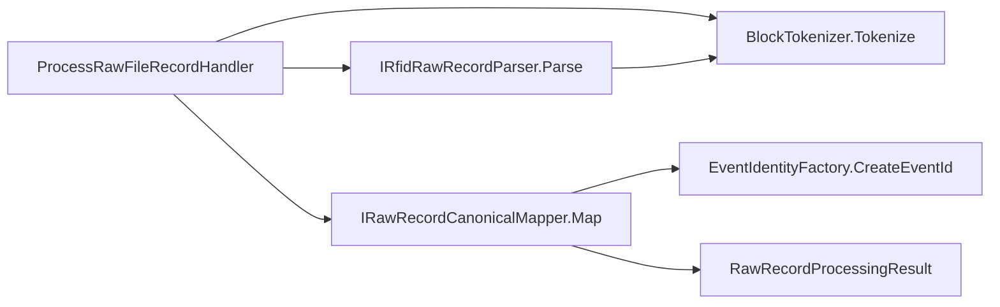

### Flowchart Logic
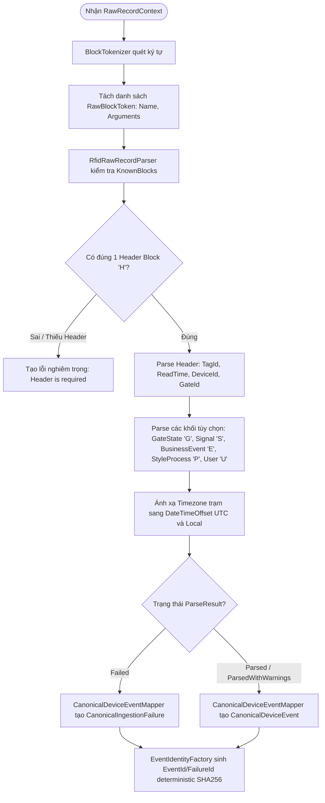

### Code snippet thực tế
```csharp
// src/DeviceEventHistory.Infrastructure/RfidRawLog/Parsing/BlockTokenizer.cs:16-64
while (index < rawPayload.Length)
{
    SkipWhitespace(rawPayload, ref index);
    if (index >= rawPayload.Length || IsTerminatorAt(rawPayload, index))
    {
        break;
    }

    var nameStart = index;
    while (index < rawPayload.Length && rawPayload[index] != '(')
    {
        index++;
    }

    var name = rawPayload[nameStart..index].Trim();
    var closeIndex = FindClosingParenthesis(rawPayload, index);
    if (closeIndex < 0)
    {
        issues.Add(CreateMalformedIssue(name));
        break;
    }

    blocks.Add(new RawBlockToken
    {
        Name = name,
        Arguments = rawPayload[(index + 1)..closeIndex],
        RawText = rawPayload[nameStart..(closeIndex + 1)]
    });
    index = closeIndex + 1;
}
```

```csharp
// src/DeviceEventHistory.Application/Parsing/CanonicalDeviceEventMapper.cs:34-47
var category = parsed.BusinessEvent is not null
    ? AppConst.Categories.BusinessProcess
    : signal is not null
        ? AppConst.Categories.TagRead
        : AppConst.Categories.Unknown;

return new RawRecordProcessingResult
{
    ParseStatus = result.Status,
    Event = new CanonicalDeviceEvent
    {
        EventId = EventIdentityFactory.CreateEventId(result.Context),
        SchemaVersion = AppConst.RawLog.SchemaVersion,
        Category = category,
        SourceKind = AppConst.RawLog.SourceKind,
        CompanyId = result.Context.CompanyId,
        // ...
```

### Bảng Ánh xạ Khối Dữ liệu sang Thuộc tính Canonical
| Ký hiệu Khối | Tên Khối | Cú pháp mẫu | Thuộc tính Canonical tương ứng |
| :--- | :--- | :--- | :--- |
| **`H`** | Header | `H(E2801190,09:15:30.123,101,1)` | `Facts.TagRead.TagId`, `Device.Id`, `Device.GateId`, `OccurredAtLocal` |
| **`G`** | GateState | `G(1)` | `Facts.GateState.StateCode`, `Facts.GateState.RawValue` |
| **`S`** | Signal | `S(1,2026/08/27 09:15:30,2026/08/27 09:15:31,5,30,0.5,45.0,920.5,-65.2)` | `Facts.Signal.AntennaPort`, `SeenCount`, `TxPower`, `PeakRssiDbm`, ... |
| **`E`** | BusinessEvent | `E(2,501,10,101;102,15)` | `Facts.BusinessEvent.EventType`, `ProcessId`, `Quantity`, `ProcessIds` |
| **`P`** | StyleProcess | `P(10;20;30)` | `Facts.StyleProcess.ProcessCustom` |
| **`U`** | User | `U(8888)` | `Facts.User.UserId` |

<div class="page-footer"><span>DeviceEventHistory — Technical Flows</span><span>Trang 6</span></div>
<div class="page-break"></div>

---

## Flow 6: Idempotent Persistence & OCC Checkpoint Advance

### Vấn đề là gì?
Khi worker crash hoặc khởi động lại, các bản ghi có thể bị đọc lại. Hệ thống phải đảm bảo tính bất biến (Idempotent): nếu bản ghi đã tồn tại trong database thì bỏ qua lỗi DuplicateKey mà không làm gián đoạn xử lý. Đồng thời, Checkpoint chỉ được phép tăng tiến khi phiên bản (`version`) khớp chính xác với MongoDB (Optimistic Concurrency Control - OCC), ngăn chặn việc ghi đè sai lệch vị trí đọc khi có xung đột.

### CallGraph (Mermaid)
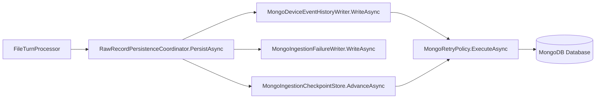

### Flowchart Logic
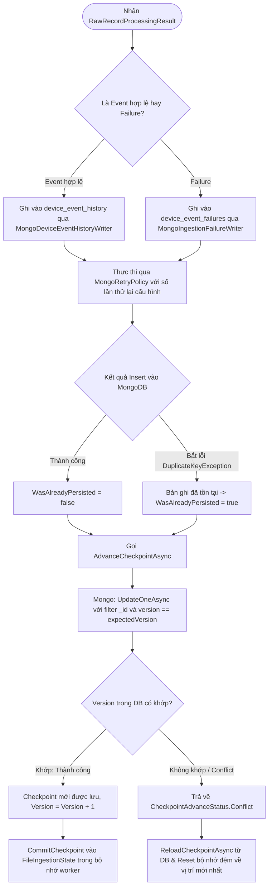

### Code snippet thực tế
```csharp
// src/DeviceEventHistory.Infrastructure/MongoDb/Stores/MongoDeviceEventHistoryWriter.cs:38-54
try
{
    await retryPolicy.ExecuteAsync(
        token => collection.InsertOneAsync(document, cancellationToken: token),
        cancellationToken);

    telemetry?.RecordHistoryWrite(
        wasAlreadyPersisted: false,
        Stopwatch.GetElapsedTime(startedAt));
    return new PersistenceWriteResult(deviceEvent.EventId, false);
}
catch (MongoWriteException exception) when (IsDuplicateKey(exception))
{
    telemetry?.RecordHistoryWrite(
        wasAlreadyPersisted: true,
        Stopwatch.GetElapsedTime(startedAt));
    return new PersistenceWriteResult(deviceEvent.EventId, true);
}
```

```csharp
// src/DeviceEventHistory.Infrastructure/MongoDb/Stores/MongoIngestionCheckpointStore.cs:53-87
var filter = Builders<BsonDocument>.Filter.And(
    Builders<BsonDocument>.Filter.Eq("_id", key.DocumentId),
    Builders<BsonDocument>.Filter.Eq("version", expectedVersion));

var update = Builders<BsonDocument>.Update
    .Set("sourceId", key.SourceId)
    .Set("folderDate", key.FolderDate.ToString(AppConst.MongoDb.CheckpointDateFormat))
    .Set("fileId", key.FileId)
    .Set("relativePath", key.RelativePath)
    .Set("position", request.Position)
    .Set("lastEventId", lastEventId)
    .Set("lastRecordHash", request.LastRecordHash)
    .Set("observedFileLength", observedFileLength)
    .Set("workerId", request.WorkerId)
    .Set("updatedAtUtc", updatedAtUtc)
    .Set("version", expectedVersion + 1);

result = await retryPolicy.ExecuteAsync(
    token => collection.UpdateOneAsync(
        filter,
        update,
        new UpdateOptions { IsUpsert = true },
        token),
    cancellationToken);
```

### Ẩn dụ thực tế (Analogy)
Giống như việc ghi sổ nhật ký giao dịch ngân hàng: Mỗi giao dịch có mã định danh duy nhất. Khi cập nhật số dư cuối ngày, giao dịch viên phải đối chiếu chính xác số thứ tự phiên ghi trước đó; nếu số phiên ghi không khớp, phải đối soát lại toàn bộ sổ cái.

<div class="page-footer"><span>DeviceEventHistory — Technical Flows</span><span>Trang 7</span></div>
<div class="page-break"></div>

---

## Flow 7: Health Monitoring, Metrics Telemetry & Graceful Shutdown

### Vấn đề là gì?
Hệ thống vận hành liên tục 24/7 đòi hỏi cơ chế giám sát sức khỏe chi tiết qua ASP.NET Core Health Checks, đo lường metrics thời gian thực (Prometheus/OpenTelemetry), đồng thời xử lý an toàn khi hệ điều hành gửi tín hiệu dừng (`SIGTERM` / `Ctrl+C`). Quá trình tắt phải cho phép consumer xử lý nốt bản ghi đang dở và lưu checkpoint an toàn mà không làm mất dữ liệu.

### CallGraph (Mermaid)
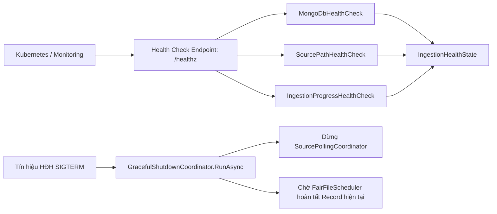

### Flowchart Logic
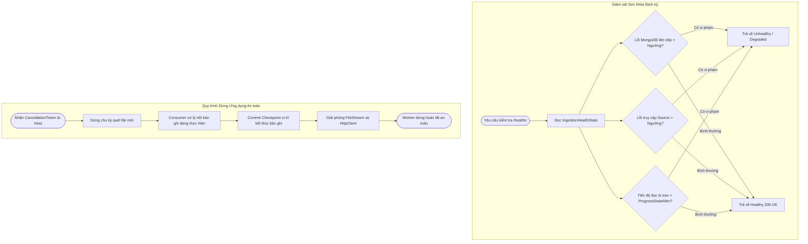

### Code snippet thực tế
```csharp
// src/DeviceEventHistory.Worker/Orchestration/GracefulShutdownCoordinator.cs:9-35
public async Task RunAsync(
    Func<CancellationToken, Task> pollingLoop,
    Func<CancellationToken, Task> schedulingLoop,
    CancellationToken stoppingToken)
{
    ArgumentNullException.ThrowIfNull(pollingLoop);
    ArgumentNullException.ThrowIfNull(schedulingLoop);

    try
    {
        // Khởi động scheduler trước để consumer sẵn sàng tiếp nhận công việc
        var schedulingTask = schedulingLoop(stoppingToken);
        var pollingTask = pollingLoop(stoppingToken);

        await Task.WhenAll(
            schedulingTask,
            pollingTask);
    }
    catch (OperationCanceledException) when (stoppingToken.IsCancellationRequested)
    {
        // HostOptions.ShutdownTimeout khống chế khoảng thời gian cho phép dừng an toàn
    }
    finally
    {
        logger.LogInformation(AppConst.Logging.IngestionStoppedMessage);
    }
}
```

<div class="page-footer"><span>DeviceEventHistory — Technical Flows</span><span>Trang 8</span></div>
<div class="page-break"></div>

---

## 9. Ma trận Tương tác giữa các Flow & Bảng Ánh xạ Source Code

### Ma trận Tương tác giữa các Flow

| Flow Kích hoạt | Flow Tiếp nhận | Dữ liệu bàn giao (Data Contract) | Cơ chế Giao tiếp / Đồng bộ |
| :--- | :--- | :--- | :--- |
| **Flow 1** (Startup) | **Flow 2 & 7** | Mongo Collections Indexed & Health Initialized | Vòng đời `IHostedService` |
| **Flow 2** (Discovery) | **Flow 3** (Scheduler) | `FileIngestionState` | CAS Interlocked & Bounded `Channel<T>` |
| **Flow 3** (Scheduler) | **Flow 4** (Reader) | `FileIngestionState` (ReadOffset) | Gọi hàm bất đồng bộ nội bộ |
| **Flow 4** (Reader) | **Flow 5** (Parser) | `RawRecordContext` (bytes, offsets) | Hàng đợi `Queue<FramedRawLogRecord>` |
| **Flow 5** (Parser) | **Flow 6** (Persistence)| `RawRecordProcessingResult` | Strongly-typed result object |
| **Flow 6** (Persistence)| **Flow 3 & 7** | `CheckpointAdvanceResult`, Latency Telemetry | Memory State Commit & Metrics Tracking |
| **Flow 7** (Shutdown) | **Tất cả các Flow** | `CancellationToken` | Cooperative Cancellation |

### Bảng Ánh xạ Source Code Hệ thống

| Phân tầng (Layer) | Đường dẫn File (Relative Path) | Trách nhiệm Kỹ thuật |
| :--- | :--- | :--- |
| **Domain** | `src/DeviceEventHistory.Domain/Events/CanonicalDeviceEvent.cs` | Định nghĩa schema chuẩn Canonical Event |
| **Domain** | `src/DeviceEventHistory.Domain/Common/AppConst.cs` | Định nghĩa hằng số hệ thống, message và format |
| **Application** | `src/DeviceEventHistory.Application/Parsing/ProcessRawFileRecordHandler.cs` | Điều phối Tokenizer, Parser và Mapper |
| **Application** | `src/DeviceEventHistory.Application/Persistence/RawRecordPersistenceCoordinator.cs` | Điều phối ghi Event/Failure và Advance Checkpoint |
| **Application** | `src/DeviceEventHistory.Application/Parsing/EventIdentityFactory.cs` | Sinh SHA256 Deterministic Hash ID |
| **Infrastructure** | `src/DeviceEventHistory.Infrastructure/RfidRawLog/Discovery/RawLogFileDiscovery.cs` | Quét file Local và Remote HTTP |
| **Infrastructure** | `src/DeviceEventHistory.Infrastructure/RfidRawLog/Reading/LocalRawLogTailReader.cs` | Đọc byte stream cục bộ không khóa (`FileShare.ReadWrite`) |
| **Infrastructure** | `src/DeviceEventHistory.Infrastructure/RfidRawLog/Reading/RemoteHttpRawLogTailReader.cs` | Đọc Range Request HTTP từ máy chủ từ xa |
| **Infrastructure** | `src/DeviceEventHistory.Infrastructure/RfidRawLog/Framing/RawLogRecordFramer.cs` | Đóng khung phân tách bản ghi bằng ký tự `!` |
| **Infrastructure** | `src/DeviceEventHistory.Infrastructure/RfidRawLog/Parsing/BlockTokenizer.cs` | Phân tích cú pháp dạng khối `Name(Args)` |
| **Infrastructure** | `src/DeviceEventHistory.Infrastructure/RfidRawLog/Parsing/RfidRawRecordParser.cs` | Parse chi tiết các trường RFID sang struct strongly-typed |
| **Infrastructure** | `src/DeviceEventHistory.Infrastructure/MongoDb/Stores/MongoDeviceEventHistoryWriter.cs` | Ghi Idempotent vào MongoDB history collection |
| **Infrastructure** | `src/DeviceEventHistory.Infrastructure/MongoDb/Stores/MongoIngestionCheckpointStore.cs` | Quản lý OCC Checkpoint vị trí đọc của từng file |
| **Worker** | `src/DeviceEventHistory.Worker/Orchestration/SourcePollingCoordinator.cs` | Vòng lặp định kỳ tìm kiếm file mới |
| **Worker** | `src/DeviceEventHistory.Worker/Orchestration/FairFileScheduler.cs` | Lập lịch công bằng Bounded Channel và Multi-consumer |
| **Worker** | `src/DeviceEventHistory.Worker/Orchestration/FileTurnProcessor.cs` | Xử lý từng lượt (turn) theo budget thời gian/bytes |
| **Worker** | `src/DeviceEventHistory.Worker/Orchestration/GracefulShutdownCoordinator.cs` | Điều phối dừng an toàn khi nhận tín hiệu tắt |

<div class="page-footer"><span>DeviceEventHistory — Technical Flows</span><span>Trang 9</span></div>
