# Tài liệu Kỹ thuật Chi tiết: Các Luồng Xử lý trong Sprint 3 (Device Event Daily Statistics)

---

## Mục lục

1. [Tổng quan Kiến trúc & Nguyên lý Thiết kế Sprint 3](#1-tổng-quan-kiến-trúc--nguyên-lý-thiết-kế-sprint-3) (Trang 1)
2. [Flow 1: Startup, Lease Acquisition & Metadata Dimension Cache Warmup](#flow-1-startup-lease-acquisition--metadata-dimension-cache-warmup) (Trang 2)
3. [Flow 2: Continuous Ingestion Stream Reader & Bounded Window Fetcher](#flow-2-continuous-ingestion-stream-reader--bounded-window-fetcher) (Trang 3)
4. [Flow 3: Business Date Assignment, TimeZone Mapping & State Continuity Aggregation](#flow-3-business-date-assignment-timezone-mapping--state-continuity-aggregation) (Trang 4)
5. [Flow 4: Atomic Batch Persistence, Local Event Deduplication & Checkpoint Advance](#flow-4-atomic-batch-persistence-local-event-deduplication--checkpoint-advance) (Trang 5)
6. [Flow 5: Durable Reconciliation Scheduler & Multi-Day Forward State Propagation](#flow-5-durable-reconciliation-scheduler--multi-day-forward-state-propagation) (Trang 6)
7. [Flow 6: Rebuild Pipeline, Version Migration & Zero-Downtime Cutover](#flow-6-rebuild-pipeline-version-migration--zero-downtime-cutover) (Trang 7)
8. [Ma trận Tương tác giữa các Thành phần & Bảng Ánh xạ Dữ liệu](#8-ma-trận-tương-tác-giữa-các-thành-phần--bảng-ánh-xạ-dữ-liệu) (Trang 8)

DeviceEventHistory — Sprint 3 Technical FlowsTrang 1

---

## 1. Tổng quan Kiến trúc & Nguyên lý Thiết kế Sprint 3

### Vấn đề bài toán
Trong Sprint 1 và Sprint 2, hệ thống đã thu nạp và ghi nhận hàng triệu bản ghi sự kiện thiết bị vào MongoDB `device_event_history`. Tuy nhiên, việc truy vấn trực tiếp trên MongoDB để lập báo cáo vận hành, tính thời lượng kết nối/mất kết nối (Online/Offline/Unknown duration), đếm số lần quét RFID, hay tính điểm sức khỏe (Health Score) theo từng ngày của thiết bị gặp các trở ngại:
1. **Tải truy vấn phân tán:** Đè nặng tải đọc lên cụm MongoDB đang phục vụ ghi log thời gian thực.
2. **Xử lý múi giờ và ngày nghiệp vụ:** Thiết bị đặt tại nhiều địa điểm với múi giờ khác nhau, ranh giới ngày nghiệp vụ phụ thuộc vào múi giờ địa phương (`StatisticsDate`) thay vì UTC thuần túy.
3. **Trạng thái liên tục xuyên ngày:** Trạng thái kết nối (Connected/Disconnected) kéo dài qua ranh giới nửa đêm (00:00:00) cần được cắt lớp (slice) chính xác thành số giây của từng ngày.

Sprint 3 thiết kế **Statistics Worker Read-Model Engine** đóng vai trò là một Async Projector độc lập, đọc dữ liệu từ MongoDB và tổng hợp sang SQL Server (`device_stats.*`) theo mô hình CQRS.

### Các nguyên tắc cốt lõi
- **Decoupled Outage:** Sự cố sập kết nối hoặc bảo trì SQL Server hoàn toàn không làm gián đoạn luồng ghi MongoDB (Sprint 1 & 2).
- **Idempotency & Fencing:** Mọi thao tác ghi SQL được bảo vệ bởi bảng `ProcessedEvent` và cơ chế phân quyền `LeaseEpoch` chống xung đột worker.
- **Durable Reconciliation:** Sự kiện đến muộn (out-of-order) được ghi nhận vào hàng đợi bền vững `ReconciliationRequest` và lan truyền trạng thái (Forward Propagation) tự động.

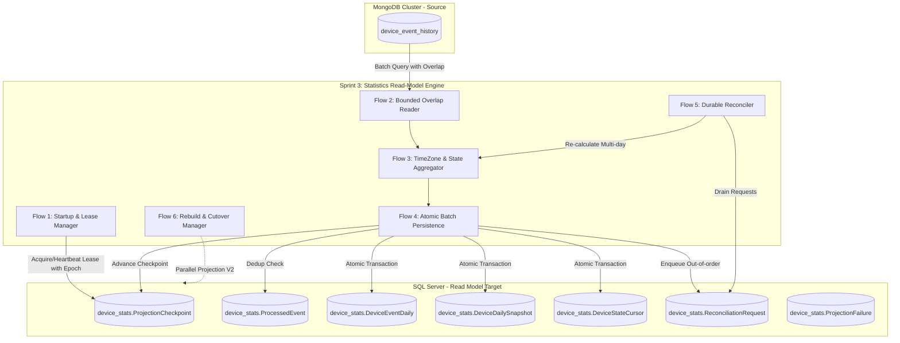

DeviceEventHistory — Sprint 3 Technical FlowsTrang 1

---

## Flow 1: Startup, Lease Acquisition & Metadata Dimension Cache Warmup

### Vấn đề là gì?
Khi Statistics Worker khởi động, nó phải đảm bảo chỉ có duy nhất một instance nắm quyền ghi (Leader / Single Writer) cho mỗi `(ProjectionName, ProjectionVersion)` để tránh xung đột dữ liệu. Đồng thời, worker cần nạp sẵn bộ đệm định nghĩa metric (`MetricDefinition`) và thông tin chiều thiết bị/múi giờ (`DeviceDimension`, `SiteDimension`) nhằm giảm thiểu truy vấn lặp lại trong quá trình xử lý dòng sự kiện liên tục.

### CallGraph (Mermaid)
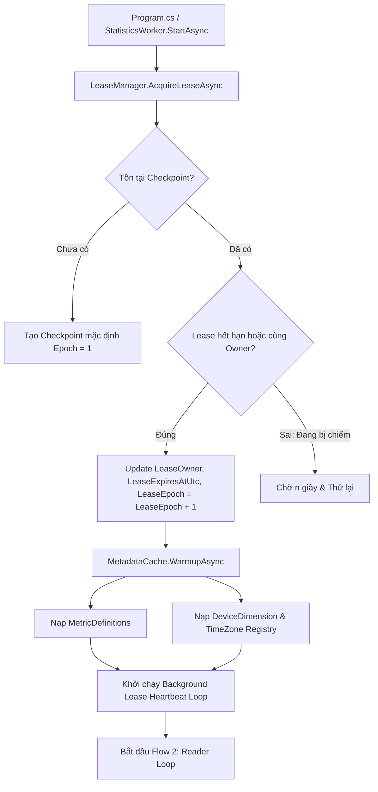

### Sequence Diagram
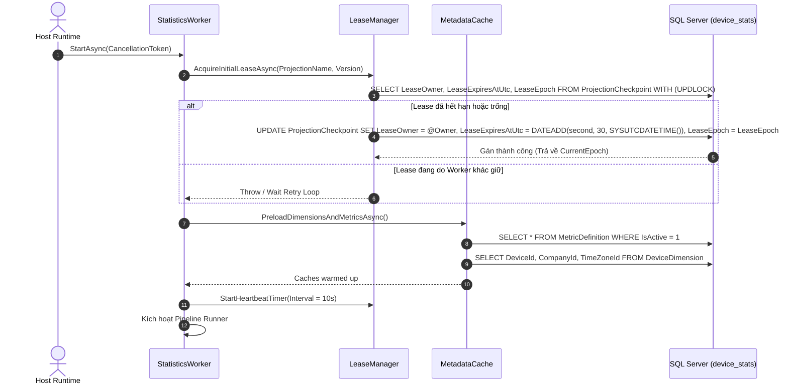

### Chi tiết Dữ liệu & Xử lý Ngoại lệ
- **Fencing Protection:** Giá trị `LeaseEpoch` nhận được từ DB được gắn vào context của Worker. Bất kỳ câu lệnh SQL ghi nào trong tương lai phát hiện `LeaseEpoch` trong DB đã bị tăng bởi instance khác sẽ tự động rollback.
- **Heartbeat Failure:** Nếu quá 3 chu kỳ heartbeat không gia hạn được lease với SQL Server do lỗi mạng, Worker tự động hủy `CancellationTokenSource`, dừng tiếp nhận batch mới và chuyển về trạng thái `Faulted/Restarting`.

DeviceEventHistory — Sprint 3 Technical FlowsTrang 2

---

## Flow 2: Continuous Ingestion Stream Reader & Bounded Window Fetcher

### Vấn đề là gì?
Hệ thống MongoDB nhận dữ liệu song song từ nhiều nguồn (Raw log & AppHub). Sự chênh lệch thời gian ghi (Commit skew) có thể khiến một sự kiện tạo sớm nhưng commit muộn bị bỏ qua nếu Worker chỉ đọc theo điều kiện `persistedAtUtc > LastPersistedAtUtc`. Do đó, Reader phải áp dụng cơ chế **Bounded Overlap Window** để đọc lùi lại một khoảng thời gian an toàn mà không làm mất sự kiện.

### CallGraph (Mermaid)
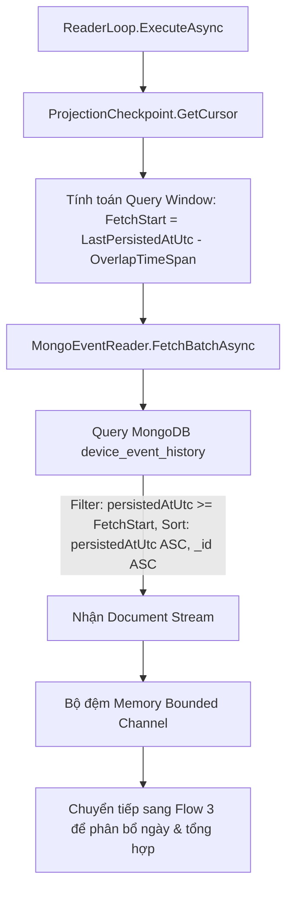

### Sequence Diagram
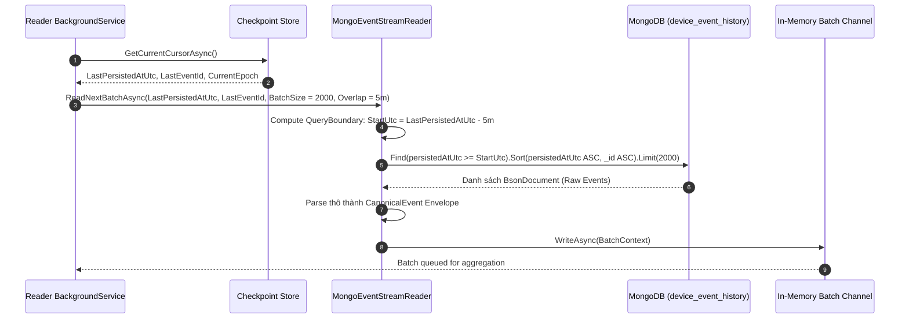

### Chi tiết Dữ liệu & Xử lý Ngoại lệ
- **Overlap Horizon:** Khoảng thời gian lùi `OverlapTimeSpan` mặc định là **5 phút** (cấu hình qua `StatisticsIngestionOptions.OverlapWindowSeconds`).
- **Tie-breaker:** Khi các sự kiện có cùng `persistedAtUtc`, thứ tự đọc được đảm bảo tuyệt đối bằng trường `_id` (hoặc `eventId`) theo thứ tự binary/ordinal tăng dần.
- **Empty Batch Backoff:** Khi không có sự kiện mới, Reader áp dụng exponential backoff từ 500ms đến tối đa 5 giây trước khi thực hiện poll tiếp theo.

DeviceEventHistory — Sprint 3 Technical FlowsTrang 3

---

## Flow 3: Business Date Assignment, TimeZone Mapping & State Continuity Aggregation

### Vấn đề là gì?
Một sự kiện mang mốc thời gian UTC (`timelineAtUtc`). Để đưa vào bảng thống kê ngày (`DeviceEventDaily`), sự kiện phải được chuyển đổi sang ngày nghiệp vụ địa phương (`StatisticsDate`) dựa trên múi giờ của thiết bị. Đối với các sự kiện trạng thái (State Transition: `Connected`, `Disconnected`), hệ thống phải phân bổ thời lượng theo từng giây và cắt đoạn chính xác khi trạng thái kéo dài qua ranh giới nửa đêm.

### CallGraph (Mermaid)
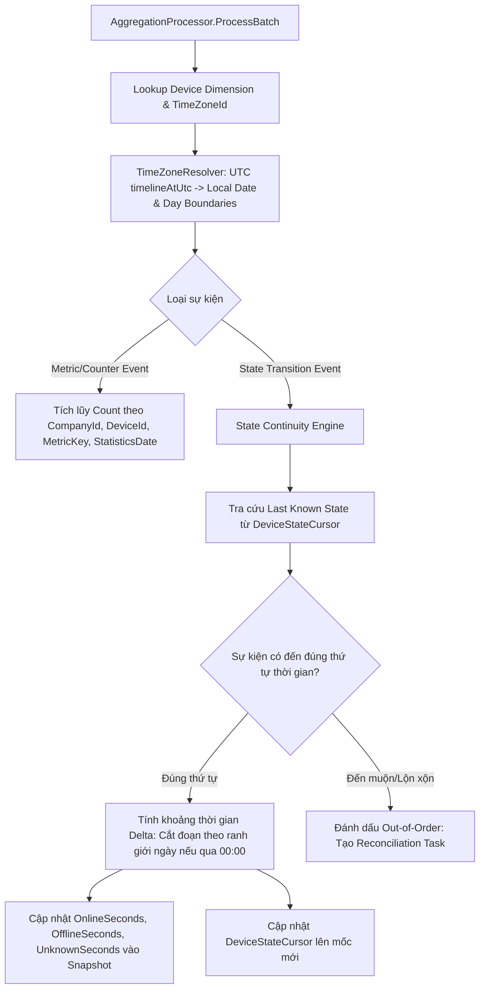

### Sequence Diagram
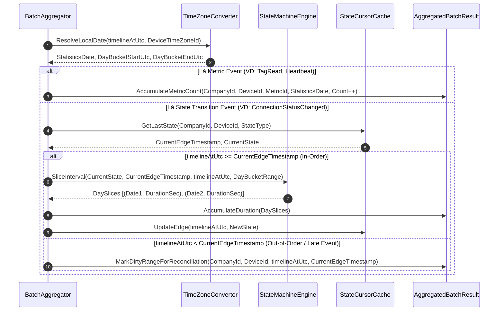

### Chi tiết Dữ liệu & Xử lý Ngoại lệ
- **Day Boundary Slicing:** Nếu thiết bị `Connected` từ 22:00:00 ngày $D$ đến 03:00:00 ngày $D+1$:
  - Ngày $D$: Cộng `OnlineSeconds = 7200` (từ 22:00:00 đến 23:59:59).
  - Ngày $D+1$: Cộng `OnlineSeconds = 10800` (từ 00:00:00 đến 03:00:00).
- **Duration Integrity Invariant:** Schema đảm bảo ràng buộc:
  $$\text{OnlineSeconds} + \text{OfflineSeconds} + \text{UnknownSeconds} = \text{TotalSecondsOfDay}$$
  (Tự động điều chỉnh khớp với các ngày đổi giờ DST 23 giờ hoặc 25 giờ).

DeviceEventHistory — Sprint 3 Technical FlowsTrang 4

---

## Flow 4: Atomic Batch Persistence, Local Event Deduplication & Checkpoint Advance

### Vấn đề là gì?
Để đạt tính toàn vẹn tuyệt đối (Exactly-Once Semantics tại tầng SQL Read-Model), toàn bộ các thao tác: kiểm tra trùng lặp sự kiện, cập nhật số liệu thống kê (Upsert Facts), cập nhật trạng thái ngày (Upsert Snapshots), lưu vết lỗi (Failures) và nâng con trỏ Checkpoint **bắt buộc phải thực thi trong cùng một SQL Transaction duy nhất**.

### CallGraph (Mermaid)
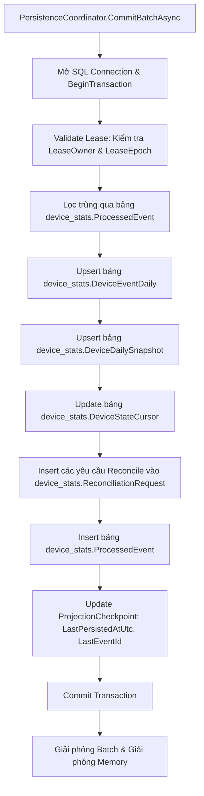

### Sequence Diagram
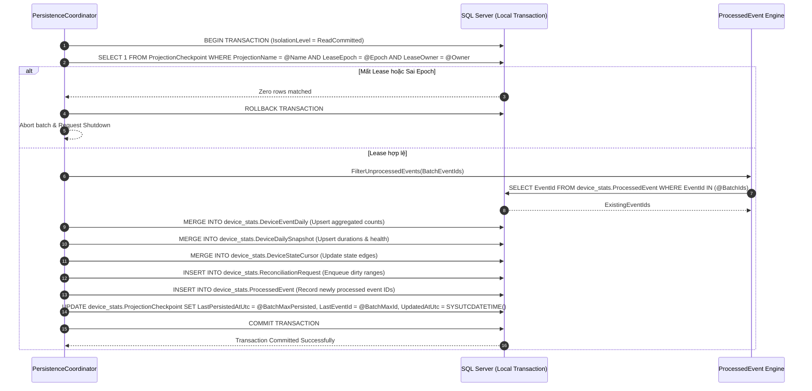

### Chi tiết Dữ liệu & Xử lý Ngoại lệ
- **Duplicate Event Skipping:** Các sự kiện đã nằm trong `ProcessedEvent` (do đọc lại từ Bounded Overlap Window) sẽ bị loại bỏ khỏi việc cộng dồn metric để tránh double-counting.
- **SQL Deadlock Retry:** Nếu gặp lỗi SQL Deadlock (Error Code 1205), Transaction tự động rollback, đợi ngẫu nhiên từ 100ms đến 500ms (Jittered Backoff) và thực hiện retry tối đa 3 lần trước khi đánh dấu `ProjectionFailure`.

DeviceEventHistory — Sprint 3 Technical FlowsTrang 5

---

## Flow 5: Durable Reconciliation Scheduler & Multi-Day Forward State Propagation

### Vấn đề là gì?
Khi sự kiện chuyển trạng thái đến muộn (ví dụ: lúc 23:00 ngày $D$ nhận được sự kiện `Connected`, trong khi hệ thống đã tổng hợp đến ngày $D+2$ với giả định thiết bị đang `Disconnected`), toàn bộ trạng thái mở đầu (Opening State) và thời lượng của ngày $D$, $D+1$, $D+2$ bị sai lệch. Hệ thống cần một tiến trình chạy ngầm bền vững để tính toán lại toàn bộ chuỗi ngày bị ảnh hưởng mà không làm khóa chết luồng Ingestion chính.

### CallGraph (Mermaid)
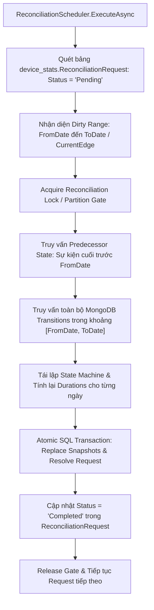

### Sequence Diagram
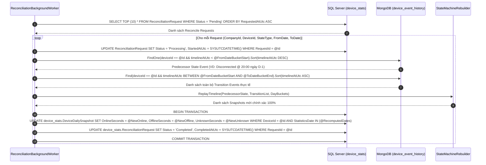

### Chi tiết Dữ liệu & Xử lý Ngoại lệ
- **Predecessor State Guarantee:** Luôn truy vấn sự kiện gần nhất xảy ra *trước* mốc bắt đầu của khoảng tính toán lại để làm gốc (Seed State), đảm bảo không bao giờ bị rơi vào trạng thái `Unknown` giả tạo tại thời điểm 00:00:00.
- **Forward Propagation Bound:** Dải tính toán lại kéo dài từ `FromDate` đến khi gặp một mốc trạng thái ổn định đã biết hoặc đến tận `DeviceStateCursor.CurrentEdgeTimestamp`.

DeviceEventHistory — Sprint 3 Technical FlowsTrang 6

---

## Flow 6: Rebuild Pipeline, Version Migration & Zero-Downtime Cutover

### Vấn đề là gì?
Khi có sự thay đổi lớn về quy tắc tính điểm sức khỏe (Health Rule V2), bổ sung công thức tính chỉ số mới hoặc sửa đổi cấu hình múi giờ toàn hệ thống, toàn bộ dữ liệu lịch sử cần được tính toán lại từ đầu (Full Historical Rebuild). Việc Rebuild phải chạy song song mà không làm gián đoạn bảng dữ liệu đang phục vụ báo cáo trực tiếp (Zero-Downtime).

### CallGraph (Mermaid)
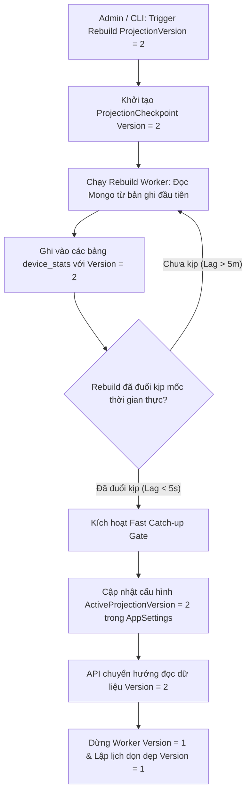

### Sequence Diagram
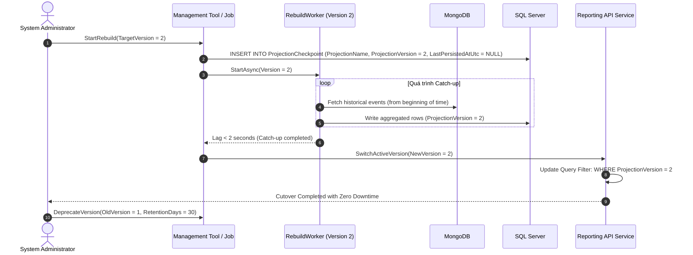

### Chi tiết Dữ liệu & Xử lý Ngoại lệ
- **Partitioning Isolation:** Khóa chính của mọi bảng trong `device_stats` đều chứa `ProjectionVersion` ở đầu (`PK: [ProjectionVersion], [CompanyId], [DeviceId]...`). Điều này giúp cô lập hoàn toàn I/O giữa phiên bản đang chạy (V1) và phiên bản đang tính toán lại (V2).
- **Rollback Safety:** Nếu phát hiện thuật toán V2 có sai sót sau khi cutover, quản trị viên chỉ cần chuyển cấu hình API đọc về `ProjectionVersion = 1` ngay lập tức mà không cần khôi phục database.

DeviceEventHistory — Sprint 3 Technical FlowsTrang 7

---

## 8. Ma trận Tương tác giữa các Thành phần & Bảng Ánh xạ Dữ liệu

### Ma trận Trách nhiệm Thành phần (Component Responsibility Matrix)

| Thành phần CSDL / Module | Vai trò chính trong Sprint 3 | Nguồn tương tác (Writer) | Đích tiêu thụ (Reader) |
| :--- | :--- | :--- | :--- |
| **`device_event_history` (Mongo)** | Nguồn dữ liệu sự kiện thô duy nhất | Ingestion Worker (Sprint 1 & 2) | Flow 2 (Reader), Flow 5 (Reconciler), Flow 6 (Rebuild) |
| **`ProjectionCheckpoint` (SQL)** | Quản lý vị trí đọc và phân quyền Lease | Flow 1 (Lease), Flow 4 (Checkpoint) | Flow 1 (Startup), Flow 2 (Reader Loop) |
| **`ProcessedEvent` (SQL)** | Bảo đảm Exactly-Once, lọc trùng lặp | Flow 4 (Transaction Writer) | Flow 4 (Idempotency Checker) |
| **`DeviceEventDaily` (SQL)** | Bảng dữ liệu thống kê sự kiện theo ngày | Flow 4 (Incremental), Flow 6 (Rebuild) | Reporting API / Dashboard Query |
| **`DeviceDailySnapshot` (SQL)** | Bảng thời lượng online/offline & điểm sức khỏe | Flow 4 (Incremental), Flow 5 (Reconcile) | Executive Summary & SLA Metrics API |
| **`DeviceStateCursor` (SQL)** | Lưu vết trạng thái và mốc thời gian tức thời | Flow 4 (Incremental State Edge) | Flow 3 (State Continuity Engine) |
| **`ReconciliationRequest` (SQL)** | Hàng đợi bền vững lưu các dải ngày cần tính lại | Flow 4 (Out-of-order detector) | Flow 5 (Reconciliation Worker) |
| **`ProjectionFailure` (SQL)** | Nhật ký sự cố không thể tổng hợp | Flow 4 (Exception Handler) | Alerting System & DevSecOps Portal |

---

### Bảng Ánh xạ Lớp Đối tượng & Tệp Mã Nguồn Dự kiến (Source Code Mapping)

| Luồng kỹ thuật | Tệp dự kiến (Proposed File Path) | Trách nhiệm chính |
| :--- | :--- | :--- |
| **Flow 1** | `src/DeviceEventHistory.Statistics/Hosting/LeaseManager.cs` | Quản lý vòng đời Distributed Lease, tăng `LeaseEpoch` |
| **Flow 1** | `src/DeviceEventHistory.Statistics/Metadata/MetadataDimensionCache.cs` | Cache kích thước nhẹ cho Metric definitions & Múi giờ |
| **Flow 2** | `src/DeviceEventHistory.Statistics/Ingestion/MongoEventStreamReader.cs` | Đọc Mongo với Bounded Overlap Window |
| **Flow 3** | `src/DeviceEventHistory.Statistics/Aggregation/TimeZoneResolver.cs` | Chuyển đổi UTC sang ngày nghiệp vụ địa phương |
| **Flow 3** | `src/DeviceEventHistory.Statistics/Aggregation/StateContinuityEngine.cs` | Chia tách thời lượng trạng thái xuyên ngày 00:00 |
| **Flow 4** | `src/DeviceEventHistory.Statistics/Persistence/StatisticsPersistenceCoordinator.cs` | Thực thi Transaction ghi SQL Server (Atomic Batch) |
| **Flow 5** | `src/DeviceEventHistory.Statistics/Reconciliation/ReconciliationBackgroundWorker.cs` | Xử lý hàng đợi sự kiện muộn và lan truyền trạng thái |
| **Flow 6** | `src/DeviceEventHistory.Statistics/Management/RebuildVersionManager.cs` | Điều phối Rebuild lịch sử và chuyển phiên bản V1 sang V2 |

DeviceEventHistory — Sprint 3 Technical FlowsTrang 8

